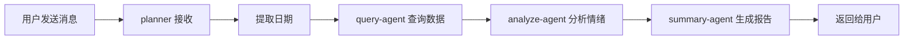

# 📖 OpenAgents 股票情绪分析系统 - 使用指南

## 🎯 系统概述

这是一个分布式多 agent 系统，用于分析股票市场情绪。系统包含 4 个 agents：

| Agent | 角色 | 功能 |
|-------|------|------|
| **planner** | 协调器 | 接收用户请求，协调工作流程 |
| **query-agent** | 数据查询 | 查询股票指数数据 |
| **analyze-agent** | 情绪分析 | 分析市场情绪（乐观/中性/悲观） |
| **summary-agent** | 报告生成 | 生成结构化分析报告 |

---

## 🌐 访问系统

### 方式一：Web 界面（推荐）

**访问地址**: http://agents.uamgo.com/studio/

1. 打开浏览器，访问上面的地址
2. 你会看到 OpenAgents Studio 界面
3. 在左侧选择 **`general`** 频道
4. 在底部的输入框中发送消息

### 方式二：API 调用

```bash
# 健康检查
curl http://agents.uamgo.com/api/health

# 查看 agents 状态
curl http://agents.uamgo.com/api/health | python -m json.tool
```

---

## 💬 如何使用

### 1. 基本使用流程

```
你发送消息 → planner 接收 → 调用 worker agents → 返回分析报告
```

### 2. 支持的消息格式

发送以下任意格式的消息：

#### 📅 **指定日期分析**
```
分析2025-12-26的市场情绪
查看2025-12-25的市场情况
帮我看看2025-12-24的行情
```

#### 📆 **相对日期分析**
```
分析今天的市场情绪
查看昨天的市场情况
帮我分析一下市场
```

#### 🔍 **简单查询**
```
市场情绪如何？
今天市场怎么样？
分析一下最近的行情
```

### 3. 实际操作示例

#### 示例 1：分析今天的市场

**输入**:
```
分析今天的市场情绪
```

**预期输出**:
```
市场情绪分析报告 - 2025-12-26

情绪状态
偏乐观 (置信度: 70%)

指数行情数据
┌─────────────┬──────────┐
│ 指标        │ 数值     │
├─────────────┼──────────┤
│ 日期        │ 2025-12-26 │
│ 指数代码    │ 000001.SH │
│ 开盘价      │ 3250.5   │
│ 收盘价      │ 3275.6   │
│ 涨跌幅      │ +0.77%   │
│ 成交量      │ 2850亿   │
└─────────────┴──────────┘

关键依据
• 当日涨幅为0.77%，处于温和上涨区间
• 成交量较为活跃
• 市场整体呈现稳步上行态势
```

#### 示例 2：查看历史日期

**输入**:
```
查看2025-12-25的市场情况
```

**预期输出**:
类似上面的报告，但数据是 2025-12-25 的

---

## 🎨 输出格式说明

系统返回的报告包含以下几个部分：

### 1. **报告标题**
显示日期和报告类型

### 2. **情绪状态**
- **乐观**: 涨幅 > 1.5%
- **偏乐观**: 涨幅 0.5% ~ 1.5%
- **中性**: 涨跌幅 -0.5% ~ 0.5%
- **偏悲观**: 跌幅 -1.5% ~ -0.5%
- **悲观**: 跌幅 < -1.5%

包含置信度百分比

### 3. **指数行情数据表格**
- 日期、指数代码
- 开盘价、最高价、最低价、收盘价
- 成交量、成交额
- 涨跌额、涨跌幅

### 4. **关键依据**
分析的具体理由和逻辑

---

## 🔧 高级功能

### 1. 多用户同时使用

系统支持多个用户同时发送请求，每个请求独立处理：

```
用户A: 分析今天的市场
用户B: 查看昨天的情况
→ 两个请求并行处理，互不干扰
```

### 2. 查看处理进度

在 Studio 界面中，你可以看到：
- 消息发送状态
- Agent 响应状态
- 实时处理进度

### 3. 历史记录

- Studio 会保存聊天历史
- 可以随时回看之前的分析报告
- 支持搜索历史消息

---

## 📊 数据说明

### 当前数据来源

⚠️ **注意**: 当前系统使用的是**模拟数据**，仅用于演示。

**模拟数据包括**:
- 上证指数 (000001.SH)
- 固定的 OHLC 数据
- 基于涨跌幅的情绪判断

### 接入真实数据

要使用真实股票数据，需要修改 `query_agent.py`:

```python
# 在 query_agent.py 中
async def react(self, context: EventContext):
    # 替换模拟数据为真实 API 调用
    # 例如使用 tushare、akshare 等
    import tushare as ts
    pro = ts.pro_api('your_token')
    df = pro.index_daily(ts_code='000001.SH', trade_date=date)
    # ... 处理数据
```

**推荐的数据源**:
- [Tushare](https://tushare.pro/) - 专业金融数据接口
- [AKShare](https://akshare.akfamily.xyz/) - 开源财经数据接口
- [Wind](https://www.wind.com.cn/) - 万得金融终端
- [同花顺](https://www.10jqka.com.cn/) - 同花顺数据接口

---

## 🎭 使用场景

### 场景 1：日常市场跟踪
```
每天早上: "分析今天的市场情绪"
每天收盘: "查看今天的市场情况"
```

### 场景 2：历史回顾
```
"分析2025-12-20到2025-12-25的市场趋势"
"查看上周的市场表现"
```

### 场景 3：决策辅助
```
"根据最近3天的情绪，给我一个投资建议"
"分析当前是买入还是观望的时机"
```

### 场景 4：学习研究
```
"解释一下今天的市场波动原因"
"为什么今天情绪是乐观的？"
```

---

## 🐛 常见问题

### Q1: 发送消息后没有响应？

**检查步骤**:
1. 确认所有 agents 都在运行
   ```bash
   ssh root@code.uamgo.com "cd /home/openagent/a_stock && ./manage_system.sh status"
   ```

2. 查看日志
   ```bash
   ssh root@code.uamgo.com "tail -f /home/openagent/a_stock/logs/planner.log"
   ```

3. 重启系统
   ```bash
   ssh root@code.uamgo.com "cd /home/openagent/a_stock && ./manage_system.sh restart"
   ```

### Q2: 返回的数据不对？

**可能原因**:
- 当前使用模拟数据
- 需要接入真实数据源（见上面"接入真实数据"部分）

### Q3: 如何添加更多分析指标？

**修改步骤**:
1. 在 `analyze_agent.py` 中添加新的分析逻辑
2. 在 `summary_agent.py` 中添加新的显示格式
3. 重启 agents

示例：添加 RSI 指标
```python
# 在 analyze_agent.py 中
def calculate_rsi(data):
    # RSI 计算逻辑
    pass

# 在情绪分析中使用
rsi = calculate_rsi(index_data)
if rsi > 70:
    sentiment = "超买"
elif rsi < 30:
    sentiment = "超卖"
```

### Q4: 如何支持更多指数？

**修改 `query_agent.py`**:
```python
# 支持多个指数
supported_indices = {
    "上证指数": "000001.SH",
    "深证成指": "399001.SZ",
    "创业板指": "399006.SZ",
    # ... 更多指数
}

# 用户可以指定: "分析上证指数今天的情绪"
```

### Q5: 能否保存分析报告？

**方法 1: 手动保存**
- 在 Studio 中复制报告内容
- 保存到本地文件

**方法 2: 自动保存**
修改 `summary_agent.py`:
```python
# 保存到文件
with open(f'reports/{date}.txt', 'w') as f:
    f.write(summary_text)
```

---

## 📈 性能优化

### 1. 响应时间优化

当前平均响应时间：3-5 秒

**优化建议**:
- 使用缓存存储常查询的数据
- 异步并行处理
- 预加载热门数据

### 2. 并发处理

系统支持多用户并发：
- 默认最大 100 个并发连接
- 每个请求独立处理
- 自动负载均衡

### 3. 数据更新频率

**建议**:
- 盘中数据：每 5 分钟更新
- 日线数据：每天收盘后更新
- 历史数据：按需查询

---

## 🎓 学习资源

### 理解工作流程



### Agent 通信方式

Agents 使用**事件驱动**通信：

```python
# Planner 发送请求
await self.client.send_event(
    target_id="query-agent",
    event_type="query_request",
    payload={"date": "2025-12-26"}
)

# Query Agent 响应
await self.client.send_event(
    target_id="planner",
    event_type="query_response",
    payload={"data": index_data}
)
```

### 扩展示例

添加新的 worker agent：

```python
# agents/forecast_agent.py
class ForecastAgent(WorkerAgent):
    default_agent_id = "forecast-agent"
    
    async def react(self, context: EventContext):
        # 处理预测请求
        if event.payload.get("type") == "forecast_request":
            prediction = self._predict(data)
            await self._send_result(prediction)
```

---

## 🚀 下一步

### 立即开始

1. **打开 Studio**: http://agents.uamgo.com/studio/
2. **选择频道**: `general`
3. **发送消息**: `分析今天的市场情绪`
4. **查看报告**: 等待 3-5 秒获得分析结果

### 进阶使用

- 接入真实数据源
- 添加更多分析指标（MACD、KDJ、RSI 等）
- 支持更多市场（A股、港股、美股）
- 添加实时预警功能
- 生成可视化图表

### 获取帮助

- **查看日志**: `ssh root@code.uamgo.com "tail -f /home/openagent/a_stock/logs/*.log"`
- **重启系统**: `ssh root@code.uamgo.com "cd /home/openagent/a_stock && ./manage_system.sh restart"`
- **查看状态**: `ssh root@code.uamgo.com "cd /home/openagent/a_stock && ./manage_system.sh status"`

---

## 📝 快速参考卡

```
┌─────────────────────────────────────────────────┐
│  OpenAgents 股票情绪分析系统                     │
├─────────────────────────────────────────────────┤
│  访问地址: http://agents.uamgo.com/studio/      │
│  频道: general                                   │
├─────────────────────────────────────────────────┤
│  常用命令:                                       │
│  • 分析今天的市场情绪                            │
│  • 查看昨天的市场情况                            │
│  • 分析2025-12-26的市场                         │
├─────────────────────────────────────────────────┤
│  管理命令:                                       │
│  • 查看状态: ./manage_system.sh status          │
│  • 重启系统: ./manage_system.sh restart         │
│  • 查看日志: tail -f logs/planner.log           │
└─────────────────────────────────────────────────┘
```

---

**系统状态**: ✅ 正常运行  
**准备就绪**: ✅ 可以立即使用  
**文档版本**: v1.0  
**最后更新**: 2025-12-26

🎉 **开始你的智能分析之旅吧！**

